# S720介绍

S720是一款基于紫光展锐平台的LTE无线通信智能模组，支持制式包含FDD-LTE、TDD-LTE、WCDMA、GSM四模通信，同时支持GNSS、Bluetooth4.2、Wi-Fi2.4G。支持显示屏、摄像头、SD、MIC、Speaker、耳机、USB2.0等。 S720支持Android10系统，适用于智能POS、智能网关、视频监控、行车记录仪、DVR、车载支付设备、执法设备、智能手持设备、智能穿戴、售卖机、物流柜等终端，能够满足用户在工业、车载和消费类应用中对高速率和多媒体功能的需求。

# 模组开机


在按键中，POWER ON按键为开机/关机按键，S720开发套件上电后，长按POWER ON键约3秒即可使模块开机。

# 应用配置

## 驱动添加

Linux系统使用defconfig文件来配置驱动，本文以adc驱动为例，介绍如何添加一个新的驱动。

### 编写驱动文件

编写相应的驱动文件，并放到对应的目录。对应的目录一般根据驱动的类型来区分，尽量跟同一类的驱动放到一起。

如需新增一个nwy_adc文件，则需要新增对应目录source\\kernel\\kernel4.14_sprdroidq\\drivers\\nwy


添加文件之后，还需要修改source\\kernel\\kernel4.14_sprdroidq\\drivers下的Kconfig和Makefile

Kconfig文件如下所示：

```sh
source "drivers/trusty/Kconfig"**\#neoway add for adc** **source "drivers/nwy/Kconfig"** endmenu
```

Makefile如下所示：

```sh
obj-\$(CONFIG_PARPORT) += parport/ obj-\$(CONFIG_NVM) += lightnvm/ obj-y += base/ block/ misc/ mfd/ nfc/ **nwy/** obj-\$(CONFIG_LIBNVDIMM) += nvdimm/
```

### 添加并修改 Kconfig文件和Makefile文件

1. 添加source\\kernel\\kernel4.14_sprdroidq\\drivers\\nwy目录的 Kconfig 和 Makefile 文件，如下图所示：

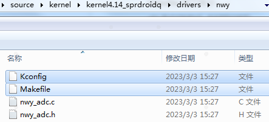

2. 修改 Makefile 文件
   根据括号里面的宏的值决定是编译进内核，编译成模块，还是不参与编译。

```sh
obj-\$(CONFIG_NWY_ADC_TEMP) += nwy_adc.o 
```

3. 修改 Kconfig 文件

可以参照已有宏的格式来添加自己的控制宏。

**注意**: 这个里面的宏比 makefile 里面的少了一个 CONFIG_，tristate代表驱动可以配置为y、m、n三种，分别代表编译进kernel，编译为模块和不参与编译

```sh
config NWY_ADC_TEMP  tristate "ADC read driver"  help  if need adc function, say y. 
```

1. 修改 config 文件
   **注意：** 对于S720_L项目，需要修改source\\kernel\\kernel4.14_sprdroidq\\arch\\arm\\configs\\S720_L_sprd_sharkle_defconfig： 添加**CONFIG_NWY_ADC_TEMP=y** |

## 检查配置

检查最终编译出来的配置文件

```sh
build-unisoc-wayland\\tmp-unisoc_wayland-glibc\\work\\sl8541e_emmc_marlin2-unisoc-linux-gnueabi\\linux-unisoc-4.14\\4.14-r0\\linux-unisoc-4.14-4.14\\.config，
```

确认是否包含了添加的 CONFIG 项。

按本文所示操作，.config文件中会包含**CONFIG_NWY_ADC_TEMP=y**

## GPIO配置 (Linux)

### GPIO介绍

GPIO是通用输入输出端口的简称，简单来说就是可控制的引脚，芯片的GPIO引脚与外部设备连接起来，从而实现与外部设备进行通讯、控制以及数据采集的功能。

### Pinmap配置

在配置pinmap之前首先要通过原理图确认模块PIN脚对应的GPIO序号，本文以模块的PIN90脚为例，如图，对应的gpio为gpio89。

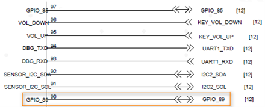

如果要将该管脚配置成GPIO功能，首先要查找手册《S720-管脚定义文档-V1.1.xlsx》。

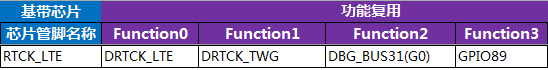

由图中可以看出，gpio89对应的Pin Name是RTCK_LTE，可以用作4种功能，Function 3为gpio功能，我们要使用的是gpio功能，在pinmap文件中根据Pin Name找到对应的配置项进行修改即可。

Pinmap文件位于bspboot15_sprdroidq720_L-sl8541e_1h10_32b.c

```sh
{REG_PIN_RTCK_LTE,                      BITS_PIN_AF(3)},
{REG_MISC_PIN_RTCK_LTE,                 BITS_PIN_DS(1)|BIT_PIN_NULL|BIT_PIN_WPD|BIT_PIN_SLP_AP|BIT_PIN_SLP_NUL|BIT_PIN_SLP_OE},
```

如上所示，找到RTCK_LTE之后，将BITS_PIN_AF配置为3，此时pin脚就可以当作普通GPIO功能使用。注意：BITS_PIN_AF配置值为0-3，分别对应pin的Function 0-3。

dts配置如下所示：

```sh
extcon_gpio: extcon-gpio {
    compatible = "linux,extcon-usb-gpio";
    vbus-gpio = <&pmic_eic 0 GPIO_ACTIVE_HIGH>;
    id-gpio = <&ap_gpio 126 0>;
    otg5v-gpio = <&ap_gpio 89 0>;
};
```

## I2C配置

### I2C介绍

I2C 通讯协议(Inter－Integrated Circuit)是由 Phiilps 公司开发的，由于它引脚少，硬件实现简单，可扩展性强，不需要 USART、CAN 等通讯协议的外部收发设备，现在被广泛地使用在系统内多个集成电路(IC)间的通讯。

S720_L项目可供客户自由使用的I2C有3组：i2c2、i2c3、i2c4。

| i2c编号 | 模块pin          | gpio编号         | 备注               |
| ------- | ---------------- | ---------------- | ------------------ |
| I2c-2   | pin-91、pin-92   | gpio127、gpio128 | 默认Sensor I2C使用 |
| I2c-3   | pin-47、pin-48   | gpio146、gpio147 | 默认触摸屏I2C使用  |
| I2c-4   | pin-168、pin-167 | gpio154、gpio155 | 默认SIM2功能       |

对于I2C的配置，需要在pinmap和设备树中配置，具体配置方法请参考下面步骤。

### Pinmap 配置

S720_L采用pinmap配置管脚功能，如果使用I2C功能需要对照下表，将对应pin配置为I2C功能。 pinmap 文件路径：

```
source\bsp\u-boot15_sprdroidq\board\spreadtrum\S720_L\pinmap-sl8541e_1h10_32b.c
```

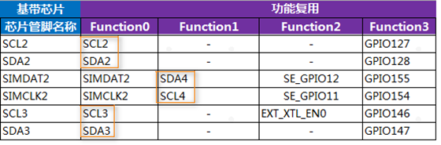

### DTS 配置

1. 确认 aliases 节点
   请在aliases节点下添加对于i2c节点的配置，如下以i2c3为例： 配置路径：

```sh
source\kernel\kernel4.14_sprdroidq\arch\arm\boot\dts\S720_L_sharkle.dtsi
```

2. 添加如下代码

```sh
aliases {
        ...
+ i2c3 = &i2c3;
  ...
  };
```

3. 确认 I2C 节点

在soc节点下添加I2C配置，以i2c3 为例： 位置： source_sprdroidq720_L_sharkle.dtsi 一般情况下，I2C的节点都是配置完成的，这里只需要检查确认即可。

```
i2c3: i2c@70800000 {
    compatible = "sprd,sharkl3-i2c";
    reg = <0x70800000 0x1000>; /*i2c寄存器地址*/
    interrupts = <GIC_SPI 14 IRQ_TYPE_LEVEL_HIGH>;
    clock-names = "enable","i2c", "source"; /*i2c时钟配置*/
    clock-frequency = <400000>; /*i2c主模式时钟频率*/
    #address-cells = <1>;
    #size-cells = <0>;
    status = "disabled"; /*注意在使用中需要使能：okay*/
};
```

4. 添加 I2C 设备节点
   i2c节点配置过后，需要添加对应的i2c设备节点，以触摸屏节点举例。 打开文件： source_sprdroidq720_L_sl8541e-1h10-gofu.dts 配置如下代码：

```
&i2c3 {
    status = "okay"; /*打开i2c使能：okay*/
    goodix@14 {
        compatible = "goodix,gt1x";
        reg = <0x14>; /*从机7位地址*/
        goodix,irq-gpio = <&ap_gpio 144 GPIO_ACTIVE_HIGH>;
        goodix,reset-gpio = <&ap_gpio 145 GPIO_ACTIVE_HIGH>;
    };
};
```

### 各路I2C 配置

#### I2C-2 配置

1. 配置pinmap：查看功能表，功能0是i2c-2功能。 打开文件：

```
   source\bsp\u-boot15_sprdroidq\board\spreadtrum\S720_L\pinmap-sl8541e_1h10_32b.c
```

配置如下代码：

```
// i2c-2, scl
{REG_PIN_SCL2,       BITS_PIN_AF(0)},
{REG_MISC_PIN_SCL2,
BITS_PIN_DS(1)|BIT_PIN_WPUS|BIT_PIN_WPU|BIT_PIN_SLP_CM4|BIT_PIN_SLP_WPU|BIT_PIN_SLP_Z},
// i2c-2, sda
{REG_PIN_SDA2,       BITS_PIN_AF(0)},
{REG_MISC_PIN_SDA2,
BITS_PIN_DS(1)|BIT_PIN_WPUS|BIT_PIN_WPU|BIT_PIN_SLP_CM4|BIT_PIN_SLP_WPU|BIT_PIN_SLP_Z},
```

**注意：** BITS_PIN_AF配置值为0-3，分别对应pin的Function 1-4。

1. 确认aliases节点 打开文件：

```sh
source\kernel\kernel4.14_sprdroidq\arch\arm\boot\dts\S720_L_sharkle.dtsi
```

确认如下代码：

```sh
aliases {
...
    i2c2 = &i2c2;
...
};
```

```sh
i2c2: i2c@70700000 {
            compatible = "sprd,sharkle-i2c";
            reg = <0x70700000 0x100>;
            interrupts = <GIC_SPI 13 IRQ_TYPE_LEVEL_HIGH>;
            clock-frequency = <100000>;
            #address-cells = <1>;
            #size-cells = <0>;
            status = "disabled";
    };
```

#### I2C-3 配置

1. 配置pinmap：查看功能表，功能0是I2C-3。 打开文件：

```
source\bsp\u-boot15_sprdroidq\board\spreadtrum\S720_L\pinmap-sl8541e_1h10_32b.c
```

配置如下代码：

```
// i2c-3, scl
{REG_PIN_SCL3,       BITS_PIN_AF(0)},
{REG_MISC_PIN_SCL3,
BITS_PIN_DS(3)|BIT_PIN_WPUS|BIT_PIN_WPU|BIT_PIN_SLP_AP|BIT_PIN_SLP_WPU|BIT_PIN_SLP_Z},
// i2c-3, sda
{REG_PIN_SDA3,       BITS_PIN_AF(0)},
{REG_MISC_PIN_SDA3,
BITS_PIN_DS(3)|BIT_PIN_WPUS|BIT_PIN_WPU|BIT_PIN_SLP_AP|BIT_PIN_SLP_WPU|BIT_PIN_SLP_Z},
```

1. 确认aliases节点： 打开文件：

```
   source\kernel\kernel4.14_sprdroidq\arch\arm\boot\dts\S720_L_sharkle.dtsi
```

确认如下代码：

```sh
    aliases {
...
        i2c3 = &i2c3;
...
    };
```

```sh
    i2c3: i2c@70800000 {
                compatible = "sprd,sharkle-i2c";
                reg = <0x70800000 0x100>;
                interrupts = <GIC_SPI 14 IRQ_TYPE_LEVEL_HIGH>;
                clock-frequency = <400000>;
                #address-cells = <1>;
                #size-cells = <0>;
                status = "disabled";
            };

```

#### I2C-4 配置

1. 配置pinmap：查看功能表，功能1是I2C-4。 打开文件：

```
   source\bsp\u-boot15_sprdroidq\board\spreadtrum\S720_L\pinmap-sl8541e_1h10_32b.c
```

配置如下代码：

```
// I2C-4, scl
{REG_PIN_SIMCLK2,       BITS_PIN_AF(1)},
{REG_MISC_PIN_SIMCLK2,
BITS_PIN_DS(1)|BIT_PIN_WPUS|BIT_PIN_WPU|BIT_PIN_SLP_AP|BIT_PIN_SLP_WPU|BIT_PIN_SLP_Z},
// I2C-4, sda
{REG_PIN_SIMDAT2,        BITS_PIN_AF(1)},
{REG_MISC_PIN_SIMDAT2,
BITS_PIN_DS(1)|BIT_PIN_WPUS|BIT_PIN_WPU|BIT_PIN_SLP_AP|BIT_PIN_SLP_WPU|BIT_PIN_SLP_Z},
```

1. 确认aliases节点：

打开文件：

```
  source\kernel\kernel4.14_sprdroidq\arch\arm\boot\dts\S720_L_sharkle.dtsi
```

确认如下代码：

```sh
aliases {
...
    i2c4 = &i2c4;
...
    };
```

```sh
i2c4: i2c@70900000 {
      compatible = "sprd,sharkle-i2c";
      reg = <0x70900000 0x100>;
      interrupts = <GIC_SPI 15 IRQ_TYPE_LEVEL_HIGH>;
      clock-frequency = <100000>;
      #address-cells = <1>;
      #size-cells = <0>;
      status = "disabled";
      };
```

## SPI配置

### SPI介绍

SPI是串行外设接口(Serial Peripheral Interface)的缩写。是 Motorola 公司推出的一
种同步串行接口技术，是一种高速的，全双工，同步的通信总线。

S720_L项目可供客户自由使用的SPI有2组，SPI0、SPI2。

| SPI编号 | 功能描述                         | 模块pin                         | gpio编号                        | 备注                        | 默认功能                            |
| ------- | -------------------------------- | ------------------------------- | ------------------------------- | --------------------------- | ----------------------------------- |
| SPI0    | SPI0_DO SPI0_DI SPI0_CS SPI0_CLK | pin-112 pin-113 pin-123 pin-124 | GPIO-91 GPIO-92 GPIO-90 GPIO-93 | 主机输出 主机接收 片选 时钟 | gpio功能 gpio功能 gpio功能 gpio功能 |
| SPI2    | SPI2_DO SPI2_DI SPI2_CS SPI2_CLK | pin-108 pin-109 pin-52 pin-110  | GPIO-54 GPIO-53 GPIO-52 GPIO-55 | 主机输出 主机接收 片选 时钟 | gpio功能 gpio功能 gpio功能 gpio功能 |

对于SPI的配置，引脚功能配置在pinmap文件中，spi节点和设备节点放在Kernel的dts中配置，具体配置方法请参照如下步骤。

### Pinmap 配置

S720_L采用pinmap配置管脚功能。如果使用SPI功能需要对照下表，将对应pin配置为SPI功能。

pinmap 文件路径：

```sh
source\\bsp\\u-boot15_sprdroidq\\board\\spreadtrum\\S720_L\\pinmap-sl8541e_1h10_32b.c
```

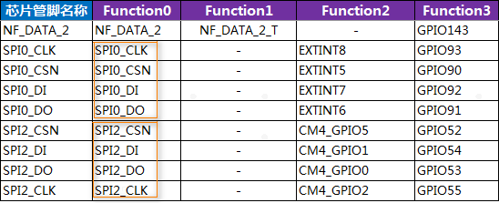

以spi0及设 备节点的配置方法举例如下。

### DTS 配置

修改 pinmap 配置

举例，配置spi0的修改：

```sh
// spi0, cs
{REG_PIN_SPI0_CSN,       BITS_PIN_AF(0)},
{REG_MISC_PIN_SPI0_CSN,
BITS_PIN_DS(1)|BIT_PIN_NULL|BIT_PIN_WPU|BIT_PIN_SLP_AP|BIT_PIN_SLP_NUL|BIT_PIN_SLP_OE},
// spi0, DO
{REG_PIN_SPI0_DO,        BITS_PIN_AF(0)},
{REG_MISC_PIN_SPI0_DO,
BITS_PIN_DS(1)|BIT_PIN_NULL|BIT_PIN_WPD|BIT_PIN_SLP_AP|BIT_PIN_SLP_WPD|BIT_PIN_SLP_Z},
// spi0, DI
{REG_PIN_SPI0_DI,        BITS_PIN_AF(0)},
{REG_MISC_PIN_SPI0_DI,
BITS_PIN_DS(1)|BIT_PIN_NULL|BIT_PIN_WPD|BIT_PIN_SLP_AP|BIT_PIN_SLP_WPD|BIT_PIN_SLP_Z},
// spi0, CLK
{REG_PIN_SPI0_CLK,       BITS_PIN_AF(0)},
{REG_MISC_PIN_SPI0_CLK,
BITS_PIN_DS(1)|BIT_PIN_NULL|BIT_PIN_WPD|BIT_PIN_SLP_AP|BIT_PIN_SLP_WPD|BIT_PIN_SLP_Z},
```

确认 aliases 节点

请在aliases节点下添加对于SPI节点的配置，如下以spi0为例：

打开文件：

```
source\\kernel\\kernel4.14_sprdroidq\\arch\\arm\\boot\\dts\\S720_L_sharkle.dtsi
```

确认以下代码：

```sh
aliases {
...
spi0 = \&spi0;
...
};
```

确认 SPI 节点

在soc节点下添加SPI配置，以SPI0 为例：

打开文件：

```sh
source\\kernel\\kernel4.14_sprdroidq\\arch\\arm\\boot\\dts\\S720_L_sharkle.dtsi
```

并确认以下代码：

```sh
spi0: spi@70a00000 {
		compatible = "sprd,sc9860-spi",
			"sprd,sharkle-spi";
		reg = <0x70a00000 0x1000>;
		interrupts = <GIC_SPI 7 IRQ_TYPE_LEVEL_HIGH>;
		#address-cells = <1>;
		#size-cells = <0>;
		status = "disabled"; /*在使用过程中请使能节点：okay*/
		};
```

一般情况下SPI的节点都是配置完成的，这里只需要检查确认即可。

添加 SPI 设备节点

SPI节点配置过后，需要添加对应的SPI设备节点，以fpga节点举例。

打开文件：

```sh
source\\kernel\\kernel4.14_sprdroidq\\arch\\arm\\boot\\dts\\S720_L_sl8541e-1h10-gofu.dts
```

参考配置以下代码：

```sh
&spi0 {
	status = "okay"; /*打开spi使能：okay*/
	fpga: fpga {
		compatible = "lattice-spi";
		spi-max-frequency = <48000000>; /*spi时钟频率*/
		crstn-gpio = <&ap_gpio 133 0>;
		rstn-gpio = <&ap_gpio 132 0>;
		reg = <0>;
	};
};
```

### 各路SPI 配置

#### SPI-0 配置

1. 配置pinmap：查看功能表，功能0是SPI-0功能。

打开文件：

```sh
source\\bsp\\u-boot15_sprdroidq\\board\\spreadtrum\\S720_L\\pinmap-sl8541e_1h10_32b.c
```

配置以下代码：

```sh
// spi0 cs
{REG_PIN_SPI0_CSN,       BITS_PIN_AF(0)},
{REG_MISC_PIN_SPI0_CSN,
BITS_PIN_DS(1)|BIT_PIN_NULL|BIT_PIN_WPU|BIT_PIN_SLP_AP|BIT_PIN_SLP_NUL|BIT_PIN_SLP_OE},
// spi0 DO
{REG_PIN_SPI0_DO,        BITS_PIN_AF(0)},
{REG_MISC_PIN_SPI0_DO,
BITS_PIN_DS(1)|BIT_PIN_NULL|BIT_PIN_WPD|BIT_PIN_SLP_AP|BIT_PIN_SLP_WPD|BIT_PIN_SLP_Z},
// spi0 DI
{REG_PIN_SPI0_DI,        BITS_PIN_AF(0)},
{REG_MISC_PIN_SPI0_DI,
BITS_PIN_DS(1)|BIT_PIN_NULL|BIT_PIN_WPD|BIT_PIN_SLP_AP|BIT_PIN_SLP_WPD|BIT_PIN_SLP_Z},
// spi0 CLK
{REG_PIN_SPI0_CLK,       BITS_PIN_AF(0)},
{REG_MISC_PIN_SPI0_CLK,
BITS_PIN_DS(1)|BIT_PIN_NULL|BIT_PIN_WPD|BIT_PIN_SLP_AP|BIT_PIN_SLP_WPD|BIT_PIN_SLP_Z},
```

1. 确认aliases节点

打开文件：

```sh
source\\kernel\\kernel4.14_sprdroidq\\arch\\arm\\boot\\dts\\S720_L_sharkle.dtsi
```

确认以下代码：

```sh
aliases {
...
spi0 = \&spi0;
...
};
```

```sh
spi0: spi@70a00000 {
		compatible = "sprd,sc9860-spi",
			"sprd,sharkle-spi";
		reg = <0x70a00000 0x1000>;
		interrupts = <GIC_SPI 7 IRQ_TYPE_LEVEL_HIGH>;
		#address-cells = <1>;
		#size-cells = <0>;
		status = "disabled";
	};
```

#### SPI-2 配置

1\. 配置pinmap：查看功能表，功能0是SPI-2。

打开文件：

```sh
source\\bsp\\u-boot15_sprdroidq\\board\\spreadtrum\\S720_L\\pinmap-sl8541e_1h10_32b.c
```

配置以下代码：

```sh
{REG_PIN_SPI2_CSN,                      BITS_PIN_AF(0)},
{REG_MISC_PIN_SPI2_CSN,                 BITS_PIN_DS(1)|BIT_PIN_NULL|BIT_PIN_WPU|BIT_PIN_SLP_AP|BIT_PIN_SLP_NUL|BIT_PIN_SLP_OE},
{REG_PIN_SPI2_DO,                       BITS_PIN_AF(0)},
BITS_PIN_DS(1)|BIT_PIN_NULL|BIT_PIN_WPD|BIT_PIN_SLP_AP|BIT_PIN_SLP_WPD|BIT_PIN_SLP_Z},
{REG_PIN_SPI2_DI,                       BITS_PIN_AF(0)},
{REG_MISC_PIN_SPI2_DI,                  BITS_PIN_DS(1)|BIT_PIN_NULL|BIT_PIN_WPD|BIT_PIN_SLP_AP|BIT_PIN_SLP_WPD|BIT_PIN_SLP_Z},
{REG_PIN_SPI2_CLK,                      BITS_PIN_AF(0)},
{REG_MISC_PIN_SPI2_CLK,                 BITS_PIN_DS(1)|BIT_PIN_NULL|BIT_PIN_WPD|BIT_PIN_SLP_AP|BIT_PIN_SLP_WPD|BIT_PIN_SLP_Z},
```

1. 确认aliases节点：

打开文件：

```sh
source\\kernel\\kernel4.14_sprdroidq\\arch\\arm\\boot\\dts\\S720_L_sharkle.dtsi
```

确认以下代码：

```sh
aliases {
...
spi2 = \&spi2;
...
};
```

```sh
spi2: spi@70c00000 {
		compatible = "sprd,sc9860-spi",
			"sprd,sharkle-spi";
		reg = <0x70c00000 0x1000>;
		interrupts = <GIC_SPI 9 IRQ_TYPE_LEVEL_HIGH>;
		#address-cells = <1>;
		#size-cells = <0>;
		status = "disabled";
	        };
```

## UART配置

### UART介绍

通用异步收发传输器（Universal Asynchronous Receiver/Transmitter)，通常称作UART。它将要传输的资料在串行通信和并行通信之间加以转换。作为把并行输入信号转成串行输出信号的芯片，UART通常被集成于其他通讯接口的连结上。

### UART使用情况

当前平台引出的uart管脚分为三组：

- DBG_TXD/ DBG_RXD，对应pin93和pin94，
- UART0_TXD/ UART0_RXD，对应pin34和pin35，
- UART2_RXD/ UART2_TXD，对应pin153和pin154。

由于芯片内部只有两个UART控制器：AP UART控制器和CM4 UART控制器，所以同时只能有两组UART起工作。

默认使用DBG_TXD/ DBG_RXD和UART2_RXD/ UART2_TXD，管脚DBG_TXD/ DBG_RXD连接到AP UART控制器，管脚UART2_RXD/ UART2_TXD连接到CM4 UART控制器。

### AP UART控制器配置

#### pinmap配置

如图，本配置需要使用模组的Pin93和Pin94引脚：

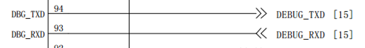

根据手册《S720-管脚定义文档-V1.1》找到它们对应的GPIO管脚：

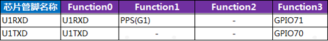

如上图所示，PIN93和PIN94脚对应的GPIO是GPIO70和GPIO71。

在pinmap文件中根据芯片管脚名称找到对应的配置项进行修改，Pinmap文件位于：

```sh
source\\bsp\\u-boot15_sprdroidq\\board\\spreadtrum\\S720_L\\pinmap-sl8541e_1h10_32b.c
```

```sh
{REG_PIN_U1TXD,	BITS_PIN_AF(0)},
{REG_MISC_PIN_U1TXD,	BITS_PIN_DS(1)|BIT_PIN_NULL|BIT_PIN_NUL|BIT_PIN_SLP_AP|BIT_PIN_SLP_NUL|BIT_PIN_SLP_OE},//BB_U1TXD
{REG_PIN_U1RXD,	BITS_PIN_AF(0)},
{REG_MISC_PIN_U1RXD,	BITS_PIN_DS(1)|BIT_PIN_NULL|BIT_PIN_WPU|BIT_PIN_SLP_AP|BIT_PIN_SLP_WPU|BIT_PIN_SLP_IE},//BB_U1RXD
```

找到对应的配置之后，对照文档《S720-管脚定义文档-V1.1》，可以看出，function 0为U1TXD/U1RXD功能，将BITS_PIN_AF配置为0，此时pin脚即作为uart功能使用。

### dts配置

pinmap配置完成之后，下一步就要做dts配置。

1. aliases添加
   打开文件

```sh
source\\kernel\\kernel4.14_sprdroidq\\arch\\arm\\boot\\dts\\ S720_L_sl8541e-1h10-gofu.dts
```

```sh
aliases {
	serial0 = &uart0;
	serial1 = &uart1;
};
```

1. 添加uart配置

   打开文件

```sh
source\\kernel\\kernel4.14_sprdroidq\\arch\\arm\\boot\\dts\\S720_L_sharkle.dtsi
```

增加uart1驱动配置，包括reg、interrupt、clock这些基本都是配置好的，在使用的时候打开即可；

```sh
uart1: serial@70100000 {
	compatible = "sprd,sc9836-uart";
	reg = <0x70100000 0x100>;
	interrupts = <GIC_SPI 3 IRQ_TYPE_LEVEL_HIGH>;
	status = "disabled";
			};
```

当需要使用uart节点的时候，将uart配置status设为ok。

在配置完成后，dev/下会生成一个名为ttyS1的节点，uart的配置就完成了。

|  | 该串口默认用作内核的console log打印。 |
| --------------------------------------------------------------------------------------------- | ------------------------------------- |

### CM4 UART控制器配置

#### pinmap配置

如图，我们所要使用的脚U2TXDG0和U2TXDG0；

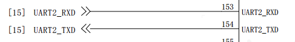

根据手册《S720-管脚定义文档-V1.1》，对应在pinmap中根据PinName找到对应的配置项进行修改；
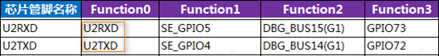

Pinmap文件位于

```sh
source\\bsp\\u-boot15_sprdroidq\\board\\spreadtrum\\S720_L\\pinmap-sl8541e_1h10_32b.c
```

```sh
{REG_PIN_U2TXD,	BITS_PIN_AF(0)},,
{REG_MISC_PIN_U2TXD,	BITS_PIN_DS(1)|BIT_PIN_NULL|BIT_PIN_NUL|BIT_PIN_SLP_AP|BIT_PIN_SLP_NUL|BIT_PIN_SLP_OE},
{REG_PIN_U2RXD,	BITS_PIN_AF(0)},
{REG_MISC_PIN_U2RXD,	BITS_PIN_DS(1)|BIT_PIN_NULL|BIT_PIN_WPU|BIT_PIN_SLP_AP|BIT_PIN_SLP_WPU|BIT_PIN_SLP_IE},
```

找到对应的配置之后，对照文档《S720-管脚定义文档-V1.1》，可以看出，function 0为U2TXD/U2RXD功能，将BITS_PIN_AF配置为0，此时pin脚即作为uart功能使用。

#### dts配置

pinmap配置完成之后，下一步就要做dts配置。

1. aliases添加

   添加在配置目录位于source\\kernel\\kernel4.14_sprdroidq\\arch\\arm\\boot\\dts\\ S720_L_sl8541e-1h10-gofu.dts

```sh
S720_L_sl8541e-1h10-gofu.dts
aliases {
	serial0 = &uart0; /*这里对应是uart控制器名字*/
	serial1 = &uart1;
};
```

1. 添加uart配置

   位于source\\kernel\\kernel4.14_sprdroidq\\arch\\arm\\boot\\dts\\S720_L_sharkle.dtsi

增加uart0驱动配置，包括reg、interrupt、clock这些基本都是配置好的，在使用的时候打开即可；

```sh
uart0: serial@508d0000 {
		compatible = "sprd,sc9836-uart-ex";
		reg = <0x508d0000 0x100>;
		interrupts = <GIC_SPI 1 IRQ_TYPE_LEVEL_HIGH>;
		sprd,aon-apb = <&aon_apb_regs>;
		status = "disabled";
			};
```

当需要使用uart0节点的时候，将uart0配置status设为ok。

在配置完成后，dev/下会生成一个名为ttySE0的节点，uart0的配置就完成了。

## 电池曲线配置

### 介绍

电池是智能模块中重要的供电部件，其充电控制和放电时的电量显示需要依赖电池的充放电曲线数据。

本文以 JBT-D009型号的电池添加到 S720_L 项目为例，介绍如何在 Linux kernel 中添加自定义的电池曲线文件。

### 设备树配置

充电芯片和电量计的配置在source\\kernel\\kernel4.14_sprdroidq\\arch\\arm\\boot\\dts\\S720_L_sl8541e-1h10-gofu.dts，chager-manager驱动为电池计量和充电的中间驱动，具有电池参数获取，充电参数获取和与用户层通信等功能。

```sh
charger-manager {
		compatible = "charger-manager";
		cm-name = "battery";
		cm-poll-mode = <2>;
		cm-poll-interval = <15000>;
		cm-battery-stat = <2>;

		cm-fullbatt-vchkdrop-ms = <30000>;
		cm-fullbatt-vchkdrop-volt = <60000>;
		cm-fullbatt-voltage = <4300000>;
		cm-fullbatt-current = <120000>;
		cm-fullbatt-capacity = <100>;

		cm-num-chargers = <1>;
		cm-chargers = "sc2721_charger";
		cm-fuel-gauge = "sc27xx-fgu";

		/* in deci centigrade */
		cm-battery-cold = <200>;
		cm-battery-cold-in-minus;
		cm-battery-hot = <800>;
		cm-battery-temp-diff = <100>;
```

其中：

- cm-chargers = "sc2721_charger"是充电芯片的配置，示例中配置为sc2721_charger内部充电芯片。
- cm-fuel-gauge = "sc27xx-fgu"是电量计的配置，示例中配置为sc27xx-fgu电量计。

对应name配置位于对应charger芯片中，搜索sc27xx_fgu_desc关键字：

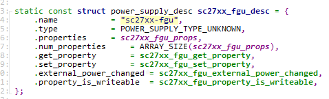

无论电量计的计量或充电都需要依赖电池参数的配置，S720_L中电量计和充电的电池配置均为monitored-battery = \<&bat\>，不建议修改。

```sh
&pmic_fgu {
	monitored-battery = <&bat>;
	sprd,calib-resistance-real = <20000>;
	sprd,calib-resistance-spec = <20000>;
};
&pmic_charger {
  status = "okay";
  phys = <&hsphy>;
  monitored-battery = <&bat>;
};
```

### 电池曲线配置方法

在配置电池对应的电池之前，会从电池厂商拿到一组电池曲线和电池的说明文档，以《A.11.002.008.004 JBT-D009中英文电池规格书B版.pdf》为例。

电池组基本参数

电池规格书中一般提供电池组基本参数，包括标准容量、充电截至电压、最大充电电流、工作温度等内容，下图为JBT-D009示例：

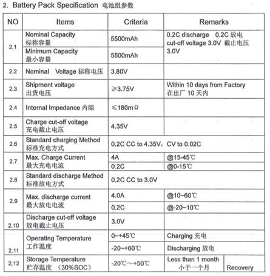

图为S720_L电池相关配置 ：

```sh
bat: battery {
		compatible = "simple-battery";
		charge-full-design-microamp-hours = <2780000>;
		charge-term-current-microamp = <120000>;
		constant_charge_voltage_max_microvolt = <4350000>;
		factory-internal-resistance-micro-ohms = <320000>;
		voltage-min-design-microvolt = <3450000>;
		ocv-capacity-celsius = <20>;
		ocv-capacity-table-0 = <4330000 100>, <4249000 95>, <4189000 90>,
					<4133000 85>, <4081000 80>, <4034000 75>,
					<3991000 70>, <3953000 65>, <3910000 60>,
					<3866000 55>, <3836000 50>, <3813000 45>,
					<3795000 40>, <3782000 35>, <3774000 30>,
					<3765000 25>, <3750000 20>, <3726000 15>,
					<3687000 10>, <3658000 5>, <3400000 0>;
		voltage-temp-table = <1095000 800>, <986000 850>, <878000 900>,
				      <775000 950>, <678000 1000>, <590000 1050>,
				      <510000 1100>, <440000 1150>, <378000 1200>,
				      <324000 1250>, <278000 1300>, <238000 1350>,
				      <204000 1400>, <175000 1450>, <150000 1500>,
				      <129000 1550>, <111000 1600>, <96000 1650>;
		charge-sdp-current-microamp = <500000 500000>;
		charge-dcp-current-microamp = <1150000 3000000>;
		charge-cdp-current-microamp = <1150000 1150000>;
		charge-unknown-current-microamp = <500000 500000>;
	};
```

参数说明如下：

- charge-full-design-microamp-hours：标准容量 uah。
- charge-term-current-microamp：截至电流 ua（可根据情况配置）。
- constant_charge_voltage_max_microvolt：最大电压。
- factory-internal-resistance-micro-ohms：电池内阻。
- voltage-min-design-microvolt：最小电压，不建议修改。
- charge-sdp-current-microamp：充电类型为sdp时的充电电流，图示为500ma—500ma。
- charge-dcp-current-microamp：充电类型为dcp时的充电电流，图示为1150ma-3000ma。
- charge-cdp-current-microamp：充电类型为cdp时的充电电流，图示为1150ma-1150ma。
- charge-unknown-current-microamp：充电类型未识别时的充电电流，图示为500ma。

  电池充电曲线配置

在配置之前，从电池厂会拿到一组基础电池数据，分温度分为0°、-10°、25°、50°四组

ocv-capacity-celsius和ocv-capacity-table-0两组数据是电池充电曲线的配置文件。

- **ocv-capacity-celsius**代表驱动需要配置20组参数，不建议修改。
- **ocv-capacity-table-0**为电池曲线配置，参数中代表电池电压和电池电量，例如，\<3953000 65\>，为电池电压在3.95v时的电池电量为65%；配置中，一共分为20档，S726中根据电池厂商提供的电池曲线表配置即可，对应的曲线温度25°。

```sh
ocv-capacity-table-0 = <4330000 100>, <4249000 95>, <4189000 90>,
					<4133000 85>, <4081000 80>, <4034000 75>,
					<3991000 70>, <3953000 65>, <3910000 60>,
					<3866000 55>, <3836000 50>, <3813000 45>,
					<3795000 40>, <3782000 35>, <3774000 30>,
					<3765000 25>, <3750000 20>, <3726000 15>,
					<3687000 10>, <3658000 5>, <3400000 0>;
```

voltage-temp-table为温度电压对照表，用于读取电池温度根据NTC变化，电池曲线无需进行修改。
